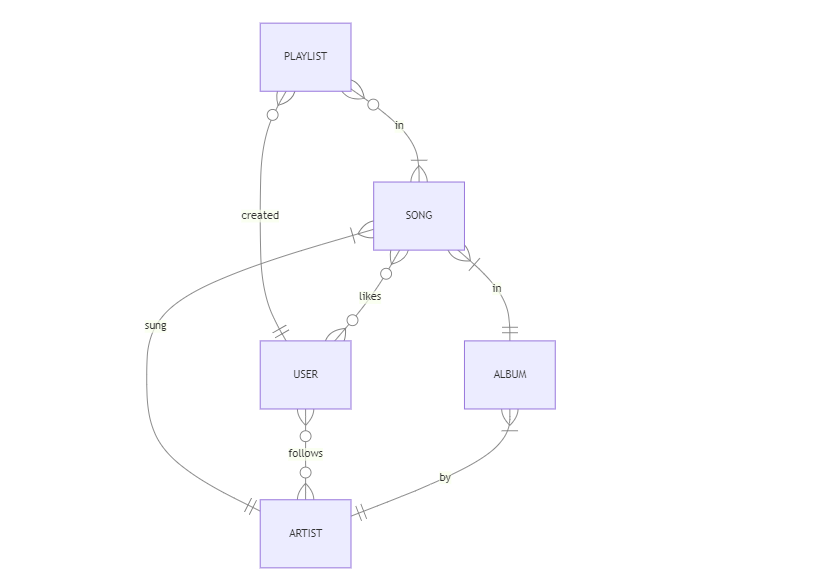

# Design Document

## Scope

In this section you should answer the following questions:

- What is the purpose of your database?
  This database includes all entities necessary to find information about songs, albums, artists, users (and which artists they follow and which songs they have liked) and playlists the users have created.

- Which people, places, things, etc. are you including in the scope of your database? Included in the database's scope is:

- Songs, including basic information such as title,release date and artist.
- Albums, including basic information such as title,release date,artist and genre.
- Artists including basic identifying information
- Users including basic identifying information
- Playlists of songs created by users.

- Which people, places, things, etc. are _outside_ the scope of your database? Outside of the scope of the database are things like number of streamings of a specific song, awards albums have won etc

## Functional Requirements

In this section you should answer the following questions:

- What should a user be able to do with your database?
  This database supports:
- CRUD actions on songs, albums, artists, playlists and users.
- Tracking all songs, albums and songs they include, playlists and the songs they include, artists and users.
- Users creating playlists of songs, where one user can create multiple playlists and a playlist can include multiple songs.
- Users liking songs, where one user can like multiple songs and a song could have been liked by multiple users.
- Users following artists,where one user can follow multiple artists and an artist can have multiple followers.

- What's beyond the scope of what a user should be able to do with your database? This system does not support users following each other (users can only follow artists & artists can not follow anyone). It also does not support artists creating playlists (only users can create playlists) or artists liking songs (only users can like songs). Also users can only like songs and cannot eg like artists,albums or playlists.

## Representation

Entities are captured in MySQL tables with the following schema.

### Entities

In this section you should answer the following questions:

- Which entities will you choose to represent in your database?
- What attributes will those entities have?
- Why did you choose the types you did?
- Why did you choose the constraints you did?

The database includes the following entities:

#### ARTISTS

The `artists` table which includes:

- `id`, which specifies the unique ID for an actor as an `INT UNSIGNED`. This column thus has the `PRIMARY KEY` constraint applied.
- `name` which specifies the artist's name as `VARCHAR` given `VARCHAR` is appropriate for namefields of various length.

The id will not take negative values and thus has the unsigned constraint applied.All columns in artists are required and thus have the not null constraint applied where a `PRIMARY KEY` constraint is not.

#### USERS

- `id`, which specifies the unique ID of a user as an `INT UNSIGNED`. This column thus has the `PRIMARY KEY` constraint applied.
- `username` which specifies the user's username as `VARCHAR` given `VARCHAR` is appropriate for namefields of various length.

The username must be unique and thus has the unique constraint applied. The id will not take negative values and thus has the unsigned constraint applied. All columns in users are required and thus have the not null constraint applied where a `PRIMARY KEY` constraint is not.

#### ALBUMS

The `albums` table which includes:

- `id`, which specifies the unique ID for the album as an `INT UNSIGNED`. This column thus has the `PRIMARY KEY` constraint applied.
- `title` which specifies the album's title as `VARCHAR` given `VARCHAR` is appropriate for namefields of various length.
- `genre` which specifies the genre of the album being specified with `SET` as a genre of an album can be one or more of the genres specified inside `SET`(pop,rock etc)- so with `SET`, more than one genres can be assigned to one album.
- `release_date` which specifies the date the album was released as `DATE`.
- `artist_id` which specifies the id of the artist who created that album and thus has the `FOREIGN KEY` constraint applied referencing the `artists` table.

All columns in albums are required and thus have the not null constraint applied where a `PRIMARY KEY` or `FOREIGN KEY` constraint is not.The `id` and `artist_id` columns will not take negative values and thus have the unsigned constraint applied.

#### SONGS

The `songs` table which includes:

- `id`, which specifies the unique ID for the song as an `INT UNSIGNED`. This column thus has the `PRIMARY KEY` constraint applied.
- `title` which specifies the song's title as `VARCHAR` given `VARCHAR` is appropriate for namefields of various length.
- `release_date` which specifies the date the song was released as `DATE`.
- `artist_id` which specifies the id of the artist that performs that song and thus has the `FOREIGN KEY` constraint applied referencing the `artists` table.
- `album_id` which specifies the id of the album this song belongs to and thus has the `FOREIGN KEY` constraint applied referencing the `albums` table.

All columns in songs are required and thus have the not null constraint applied where a `PRIMARY KEY` or `FOREIGN KEY` constraint is not.The `id`,`album_id` and `artist_id` columns will not take negative values and thus have the unsigned constraint applied.

#### PLAYLISTS

The 'playlists' table which includes:

- `id`, which specifies the unique ID of the playlist as an `INT UNSIGNED`. This column thus has the `PRIMARY KEY` constraint applied.
- `title` which specifies the playlist's title as `VARCHAR`, given `VARCHAR` is appropriate for name fields of various length.
- `user_id` which specifies the id of the user who created that playlist as `INT UNSIGNED`. This column thus has the `FOREIGN KEY` constraint applied, referencing the `id` column in the `users` table.

All columns are required and hence have the `NOT NULL` constraint applied where a `PRIMARY KEY` or `FOREIGN KEY` constraint is not. The `user_id` and `id` columns have the UNSIGNED constraint applied as they will not take negative values.

Following we also have tables created to represent relationships between other entities:

#### SONGS_IN_PLAYLISTS

THE `songs_in_playlists` table is a table to showcase the many to many relationship between songs and playlists. It includes the following colums:

- `id`, which specifies the unique ID as an `INT UNSIGNED`. This column thus has the `PRIMARY KEY` constraint applied.
- `song_id` which specifies the unique id of a song in a playlist as `INT UNSIGNED`. This column thus has the `FOREIGN KEY` constraint applied, referencing the `id` column in the `tv_shows` table.
- `playlist_id` which specifies the id of the playlist including the afformentioned song as `INT UNSIGNED`. This column thus has the `FOREIGN KEY` constraint applied, referencing the `id` column in the `playlists` table.

All of the columns have the `UNSIGNED` constraint applied as they wont take negative values.

#### FOLLOWING

THE `following` table is a table to showcase the many to many relationship between tv shows and actors. It includes the following colums:

- `id`, which specifies the unique ID as an `INT UNSIGNED`. This column thus has the `PRIMARY KEY` constraint applied.
- `artist_id` which specifies the unique id of an artist as `INT UNSIGNED`. This column thus has the `FOREIGN KEY` constraint applied, referencing the `id` column in the `artists` table.
- `user_id` which specifies the id of the user following the afforementioned artist as `INT UNSIGNED`. This column thus has the `FOREIGN KEY` constraint applied, referencing the `id` column in the `users` table.

All of the columns have the UNSIGNED constraint applied as they wont take negative values.

#### USERS LIKED SONGS

THE `userlikedsong` table is a table to showcase the many to many relationship between users and songs they liked. It includes the following colums:

- `id`, which specifies the unique ID as an `INT UNSIGNED`. This column thus has the `PRIMARY KEY` constraint applied.
- `song_id` which specifies the unique id of a song as `INT UNSIGNED`. This column thus has the `FOREIGN KEY` constraint applied, referencing the `id` column in the `songs` table.
- `user_id` which specifies the id of a song the afforementioned user has liked as `INT UNSIGNED`. This column thus has the `FOREIGN KEY` constraint applied, referencing the `id` column in the `users` table.

All of the columns have the UNSIGNED constraint applied as they wont take negative values.

---

### Relationships

In this section you should include your entity relationship diagram and describe the relationships between the entities in your database.

As detailed by the diagram:

- An album could have one to many songs in it. A song can be in one and only one album.
- An artist could have one to many songs. A song is sung by one and only one artist.
- A playlist could include one to many songs. A song could be included in zero to many lists.
- A user could have created zero to many playlists with songs. A playlist is created by only one user.
- A user could follow zero to many artists. An artist could have zero to many followers.
- A user coulld have liked 0 to many songs and a song could have been liked by 0 to many users.

## Optimizations

In this section you should answer the following questions:

- Which optimizations (e.g., indexes, views) did you create? Why?

One might want to access the followers an artist has or the artists a user follows, thus a view is created to join the `users`, `artists`, and `following` tables to simplify accessing those data.
Moreover, one might want to access the songs and artists included in a specific playlist or to find playlists including a specific song, thus another view is created for joining the tables `playlists`,`songs`, `artists`,`users` and `songs_in_playlists` to simplify accessing relevant data.
Lastly, one might want to access all the songs a user has liked or to find all the users that have liked a specific song, thus a view is created for joining the tables `songs`,`users`,`artists` and `userlikedsong`.

Furthermore, it is common for a user of the database to access all songs of a particular artist. For that reason, an index is created on the "name" columns of the "artists". Similarly, one might want to access all playlists that include a specific song or all likes a specific song has received, thus an index is created on the "title" column of tha "songs" table.

Last but not least, 3 procedures are created for inserting: one procedure for inserting into the `following` table based on the user's username and the artist's name and one for inserting into the `songs_in_playlists` table based on a song's title and the artist, the playlist's title and the user's username who created that playlist and one for inserting into `userlikedsong` table beased on the user's username and the song's title and artist who sung that song.

## Limitations

In this section you should answer the following questions:

- What are the limitations of your design?
- What might your database not be able to represent very well?

In our database there cant be songs sung by multiple artists, for that a many to many relationship would be required between artists and songs. Similarly one album can be by only one artist and a song can only be included in one album.
Moreover, if there were artists with the same name or playlists by the same user with the same title,or songs with both the same title and artist name , we should handle differently, eg insertion cases where eg we want to insert a song in a specific playlist but there are more than one different songs with both the same title and artist name or there are more than one playlists of the same user with the same title or where eg we want to add a specific artist in the following table using the artist's name but there are more than one artists with the same name, so if those corner cases were allowed would require some changes eg in our queries/schema.
